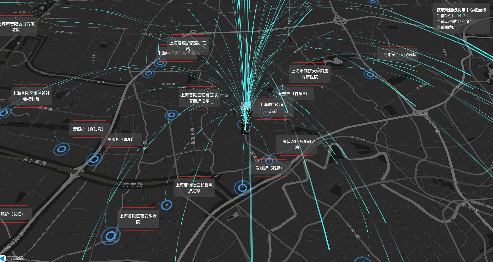
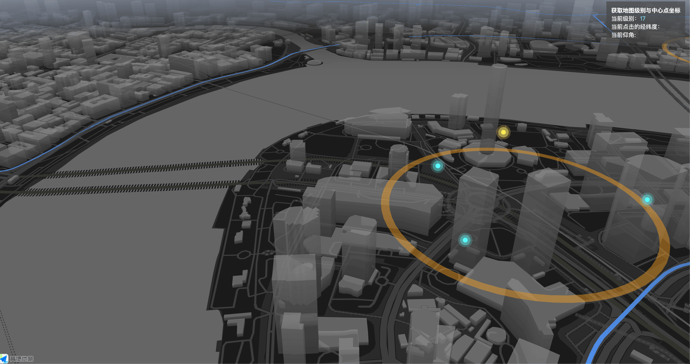
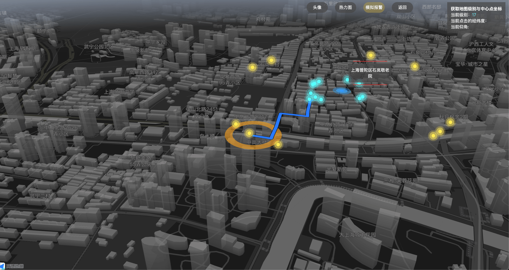
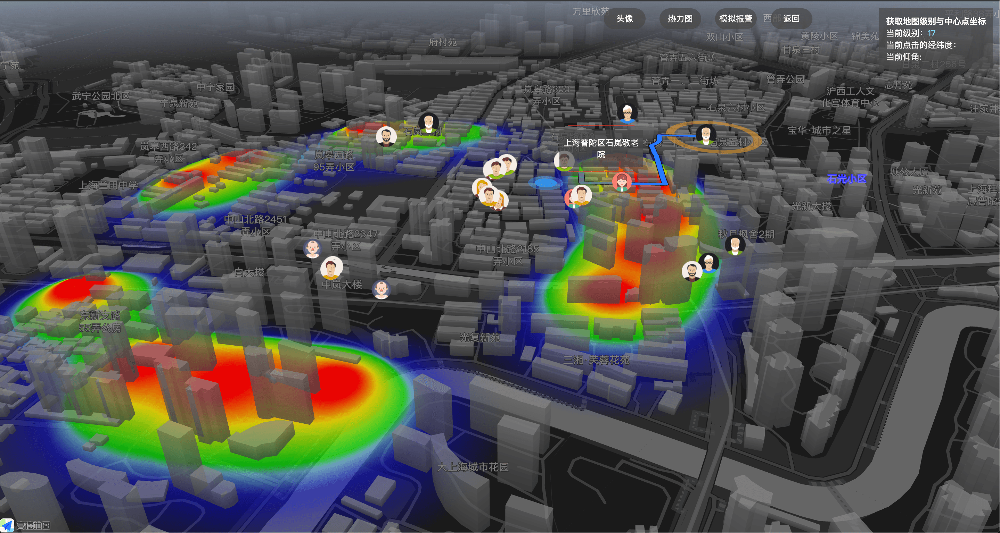

# iacc-map 一个基于 AntV 和高德地图 jssdk 的 3D 调度地图

> iacc 的意思是指社区居家养老的缩写，iacc-map 这个是我之前做的一个基于地理位置的大屏实时调度地图项目，
> 目前开源的部分大部分经过脱敏，以及项目早期的代码

## 运行地址:

https://doublenian.github.io/iacc-map/

### 下面看一下运行的截图










### 本地运行

只需要

```
npm install // or  yarn install
```

然后

```
npm run dev
```

就可以看到效果了
